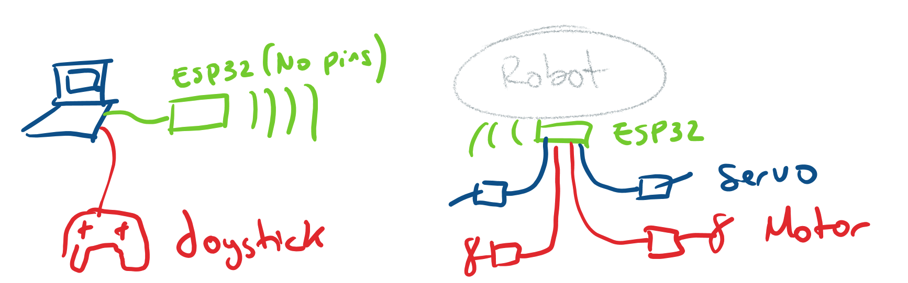

# BLIMP SWARM

BlimpSwarm is a framework to operate robots based on the ESP32 microcontroler.

### 0. Hardware setup

**Radio module:** an ESP32 connected to the base station (laptop) to act as radio communication module.
It runs the firmware in _examples/BaseTranseiver_.

**Robot:** Your robot should have a ESP32 with a robot firmware.
The firmware will depend on the type of robot:
* BicopterRaw: Send commands from the base stating to directly control two servos and two motors. No sensors or intermediate controller involved.
* Bicopter:
* 

### 1. Motor Calibration

## FAQ

### Hardware

* Why does does only one servo or one motor not work, but the rest seem operational?
You likely have a loose/broken cable connection; If the cables are not broken (and need soldering or reinserting into the connecters), try just pushing the connectors together at every intersection. This can sometimes help the mechanical connecton to reoccur. 
If this does not solve your issue with one particular motor or servo, you might have a broken speed controller or a broken servo. Try using a test servo or test motor program to test these (or a servo tester if you have one). The motor itself can also break, and you can feel it by turining them by hand and observing the consistancy of the turning. The servo can be simalarly tested, but a servo is easier to break in this way. You can usually check if the servo is correcly powered by softly attempting to move them as they are powered and seeing if they want to move. One known issue is breaking servos due to insufficent current from the voltage booster. 

* Why does everything (motors and servos) turn on, but the robot doesnt seem to move up?
You likely have inverted motors or propellers. Make sure the propellers are correctly spinning in the correct direction and are pushing air down instead of up. If they are inverted, you need to switch any two wires in the connectors. You will need a sharp object to carefully lift the plastic blockers in the connecter to remove the wires and reinsert them in opposite positions (would recommend looking at a video).
Your robot might also be too heavy. 

* Why after I tried using all your troubleshooting tips, and I still cant solve the problem; I even used some methods you didnt mention and they failed!
There is a good chance the hardware on the PCB or the ESP32 failed. You may want to try replacing these to isolate the issue if possible to see if the issue still occurs. You may also be using an old version of the code, and may want to update the entire library to the github version. Sometimes the transeiver reduces in efficency from overuse, and the harware on the PCB can fail due to current spikes during operation. 

### Firmware

* The servos keep moving to weird positions when I start up, even though I set them to point up when the robot is in 'powered rest'. ( powered rest is the base setpoint of the servos when at rest, they should be pointing straight up).
This can be caused by the pitch feedback, try turning it off when trying. If you want pitch feedback and turining it off fixed this issue: set the pitch_offset parameter to 180 degrees from its current value. 

* Why does the flight work most of the time, but the turning while moving fowards seems very strange?
You likely have your servo1 connected to motor2 and vice versa. Check your hardware connections to make sure the front servo connection is on the same pair as the front motor connection. 

* Why does the pitch feedback fail force the servos to point straight up when it pitches, and go in the opposite direction?
Try setting inverting pitch_invert on the ground station from -1 to 1 or vice versa. 

* Why does my robot spin out of control when I start it up?
Try unplugging and replugging the blimp rapidly. Sometimes the capacitor causes the startup of the BNO to fail, and it will need a restart to correctly startup. 
Your yaw is likely inverted from the correct direction; try setting your kddyaw to negative or positive from its current direction. This is usally caused by the BNO being mounted upside down, but if that is required, you may need to edit the gains to accomidate for this. You can also double check by turining off yaw_en for yaw feedback, but your robot might unintentionally move in yaw due to the difference in servo angles when you first calibrate them. 

### Ground Station

* Why doesnt serial doesnt seem to be importing even though I did '$pip install pyserial'?: 
Your text editor is likely using a different version of python than the one you installed pyserial to: check to make sure these match or install pyserial to the installation of python used by your terminal/text editor.

* Why do I keep getting messages like "could not open port" when I run the ground station code?:
There are several reasons this could occur. 
#1 Make sure that your transiever code contains the correct 'BaseTranseiver.ino' code. 
#2 Make sure that your transiever arduino is connected to your computer, and check its port matches the one in 'user_parameters.py'.
#3 Make sure that the serial monitor of the transiever arduino is closed/not occupied by another process.

* Why isn't my blimp moving even though I turned the prorgram on?
#1 Make sure the robot is turned on.
    #a Make sure that you are sending an 'on' command in the python program (most use 'B' on the controller to start).
#2 Make sure the mac address in 'user_parameters.py' matches the mac address on the blimp.
#3 Make sure the robot code is correct: one of the bicopter.ino files ex: 'MultiRobotBicopter.ino'.
#4 Make sure the battery is charged (using a battery checker or at minimum, you hear the ESCs arm when you plug the battery in).
#5 Make sure the motors are calibrated, as the calibration might result in not seeing the motors move. 
#6 If the above fail, you can follow the following debugging procedures to isolate the issue:
#a Plug in the serial cable to the robot and observe the serial monitor:
    If the serial monitor is not printing statements that have to do with the start of a robot, or sensor measurements; you likely have the wrong firmware.
    If the serial montior is working as normal, continue.
#b Check the mac address of the robot and match it to the one in 'user_parameters.py'.
    If they are different, change and test again.
#c While observing the serial monitor, turn on the ground station code. You should see commands being recieved by the blimp on the serial monitor. (this will require two USB ports and cables) (You should not have the battery plugged into the blimp for this, unless you want to see the motors turn on while observing the serial monitor.)
    If you see nothing, you likely have some transmitter/reciever issues, but I would double check the firmware on the transeiver code, and the mac and ports are matching up on 'user_parameters.py'.
    If you see commands being recieved, you likely have a working robot, but if it still doesnt work, I would check to make sure the battery is OK and that the cables are connected correctly. Mismatches in the wiring could cause no movement even when commands are being received.

### Nicla Vision

* If you are not getting feedback from your niclavison on your arduino, you may try some of the following steps:
#1 double check that the nicla has the correct code, and it is properly downloaded on board as 'main.py'.
#2 connect the Serial monitor of your ESP32 on the blimp to the computer and make sure the nicla is powered and connected to the ESP32. Check to see if the serial monitor is getting values in the sensor measurements of the nicla (values 11-20) and that they are not crazy large values that occur when the nicla has not started up yet.
#3 double check that the nicla is properly powered, or directly connect it to your computer with a cable (will require 2 USB ports and cables)
    If you are sure that your nicla is seeing things and sending values, and you do not see anything on the ESP32 side even thought they are connected, you could have a broken Nicla vison or Nicla vision PCB. Check both by replacing them one at a time to see which is actually broken. The ESP32 PCB might also be broken but it is less likely. 

